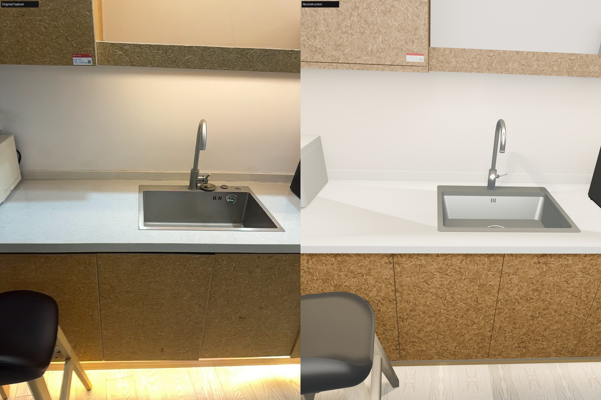

<h1 align="center">NeoWorld Studio</h1>

<strong>智能体驱动的可编辑三维物体与场景重建</strong>

  
  
  

<a href="README.md">English</a> · <strong>简体中文</strong>

> **研究预览。** 本仓库目前提供项目介绍。项目代码与 **MATRIX-Preview** 预训练权重计划从 **2026 年 9 月底**起陆续开放。

  

左侧：原始拍摄 · 右侧：Blender 渲染的重建结果 <a href="https://neoworldproject.github.io/Studio/#demos"><strong>观看场景演示 →</strong></a>

## 核心思路

NeoWorld Studio 将初始重建与智能体驱动的迭代优化相结合，从视觉观测中构建可编辑的三维物体与场景。

### 物体：初始化、观察、优化

对于每个物体，我们先生成初始重建结果 **t0**，再由智能体对照渲染视图与原始观测，调用 [NeoSDK](https://github.com/NeoWorldProject/NeoSDK) 的几何优化工具，逐步优化物体的形状与结构。

### 场景：初始化、装配、优化

在场景层面，我们首先建立环境与物体布局的初始重建。物体重建完成后，将它们装配回场景，再结合场景级视觉反馈，进一步调整几何、摆放及其与周围环境的匹配。

## 开放计划

- [x] 项目主页与场景演示
- [x] NeoWorld Studio 与 NeoSDK 仓库介绍
- [ ] 项目代码，计划从 2026 年 9 月底起陆续开放
- [ ] MATRIX-Preview 预训练权重，计划从 2026 年 9 月底起陆续开放
- [ ] 论文与 arXiv 链接

**MATRIX-Preview** 是我们面向场景重建的预训练视觉语言模型。Hugging Face 与 arXiv 链接将在可用后补充。

## 相关项目

[**NeoSDK**](https://github.com/NeoWorldProject/NeoSDK) 为重建流程提供几何构建与优化工具。

---

<a href="https://neoworldproject.github.io/Studio/">项目主页</a> · <a href="https://github.com/NeoWorldProject/NeoSDK">NeoSDK</a> · <a href="README.md">English</a>

